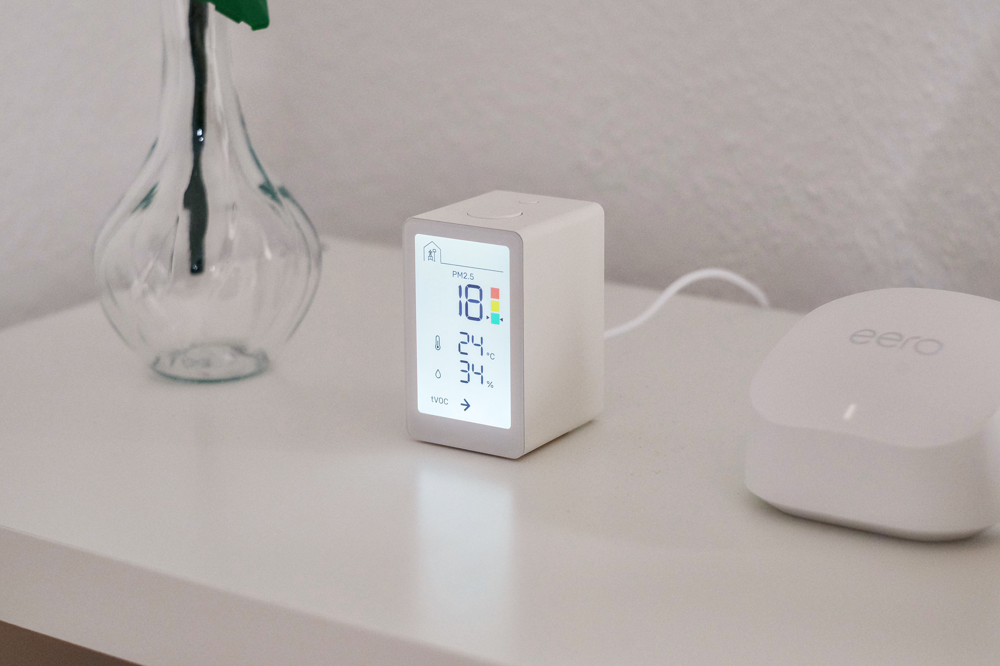
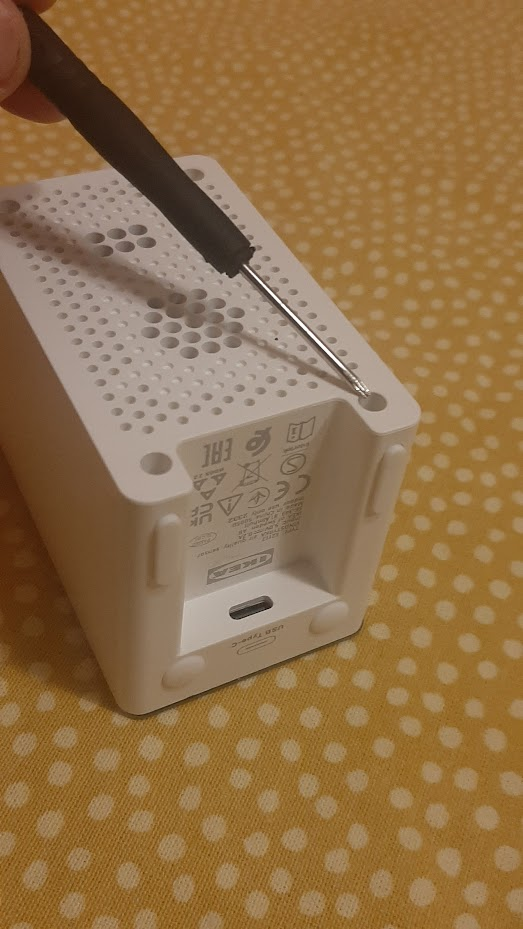
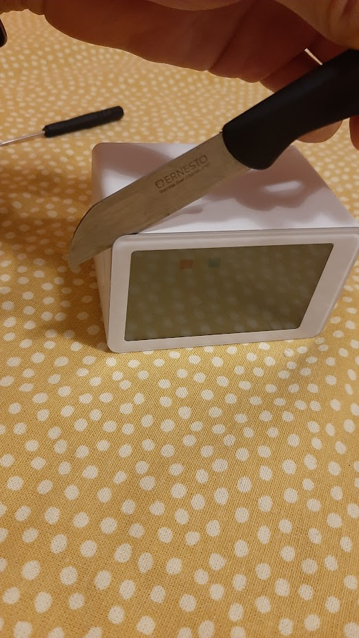
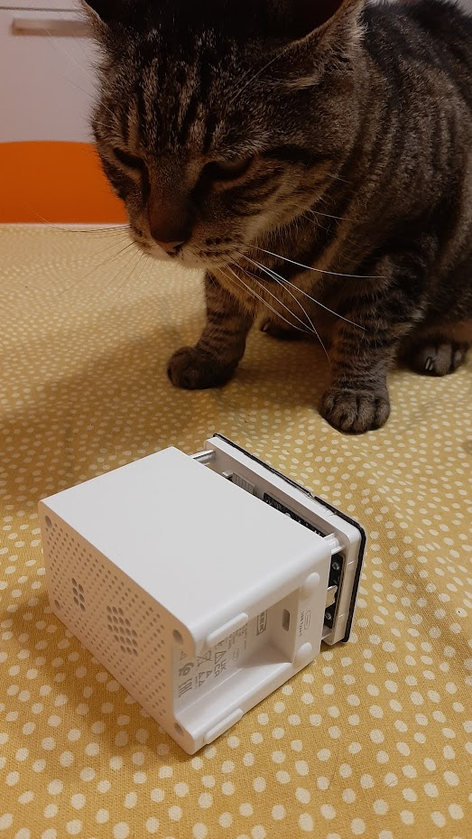
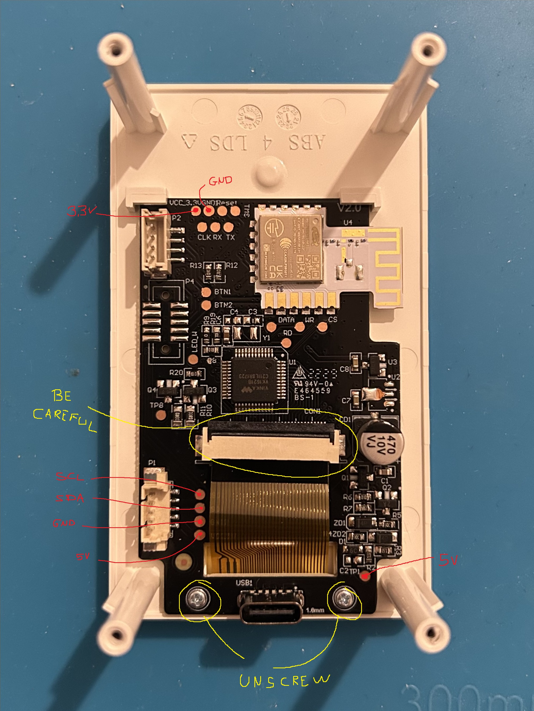

# Nuvolino

this projects accesses the Ikea VINDSTYRKA air quality sensor raw data and send them to thingspeak channels, which can therefore visualized in a comprehnsive website (e.g. https://novecento99.github.io/Nuvolino/) (yeah I'm not good at making websites). 

To do so, you will need:
- a microcontroller (such as ESP32, ESP8266 or a D1 Mini)
- some jumpers to solder your micro to the sensor
- basic soldering skills
- screwdrives: the outer screws are heaxagon, while the inner ones are classical phillips
- a (free) thingspeak account

The Ikea VINDSTYRKA is based on the SEN54 sensor, which is the top choice for its price class. Providing good accuracy for 10+ years. It measure PM1.0, PM2.5, PM4.0, PM10.0 (these last two with less accuracy then the other two.), temperature humidity and tvoc.

https://sensirion.com/products/catalog/SEN54/

## How to build this project

### step 1: teardown 
First, you have to tear down the Ikea device. Be careful and do it with patience. 

with an hexagon screwdriver take out the first 4 screws:

secondly, with a sharp knife remove the glue and deattach the screen:

a cat will spawn to judge your work:

this it the PCB:

### step 2: soldering

What I HIGLY suggest now is to **NOT** solder on test points, since they are very delicate and chances are that you're going to break the ikea microcontroller. 

Instead, take the cable that connect the sensor to the PCB, cut it in half and therefore solder 4 cables to the microcontroller.

Specifically, you need to solder 4 wires:
- Vcc (5V or 3V depending on your microcontroller supply voltage)
- GND (ground)
- SDA (one of the two pins to perform the I2C connection)
- SCL (the other pin to perform the I2C connection)

> need to put here photos

### step 3: connect your microcontroller and test the connection

4 wires: connect Vcc and Ground respectively to the correct pins to power your micro, while DSA and SCL are the two I2C protocol wires: the DSA and SCL corresponds to pins specific to the board your using.

You can easily find them by googling "yourbard I2C default pins". Here are some of them:

|  **Board**  | **SDA** | **SCL** |
|:-----------:|:-------:|:-------:|
| ESP32 WROOM |  GPIO21 |  GPIO22 |
| Arduino Uno |    A4   |    A5   |
|   D1 Mini   |  GPIO4  |  GPIO5  |

Now, download and install the [([Arduino IDE](https://www.arduino.cc/en/software))](https://github.com/Sensirion/arduino-i2c-sen5x), install through the Arduino library manager the thingspeak library. 
And install by adding them as a zip.

[([Sen5X Github](https://github.com/Sensirion/arduino-i2c-sen5x))]

Upload it to your microcontroller and connect it to your Ikea Vindistrka

If you can read the data on the serial monitor (beware to set the correct baudrate), you are ready to upload data to the cloud!

### step 4: upload data to the cloud 
First of all, it is necessary to create a channel on ThingSpeak.com to which the data can be uploaded. 

You can then Create a Channel, give your channel a name such as "Nuvolino - yourCity".

Go to Channels-> make a new channel.
8 fields with this order:
- PM1.0
- PM2.5
- PM4.0
- PM10.0
- Humidity
- Temperature
- tVOC
- Nuvolino status

Hit save channel, and you will be taken to the current view of your new channel. Go to the API Keys tab and find your Write API Key. You will need to insert this into the sketch in order to write to your channel.

Download from this git firmware/Nuvolino.ino and 
configure the starting istructions:

>unsigned long Channel_ID = YourChannelIdHere;  //replace with your Channel ID
const char *API_key = "YourKeyHere";
const char *ssid = "Your Wifi SSID here";  // replace with your wifi ssid and wpa2 key
const char *pass = "Your Wifi Password here";

Upload the firmware and you are done! open your channel, you will be able to see the data updated in real time in the channel view. You can also make gauges and numbers display by using the widget functions of thingspeak

### step 5: deploy a website
to make a website you just need to download the index.html in this git and substitute the iframes with the ones that you can easily take from your thingspeak channel

Then, upload the index.html in a github project (or just clone this one) and go to settings->XXXX. There you can take your website online with a simple click. 

## Things to do
- implement read_raw data to avoid spikes on reset
- a connection to google home would be very cool
- translations 

## Acknowledgements

@olazzari for the utility provided (and endless patience), Ikea engineers to have lended an hand to makers by exposing and naming the test points so conveniently
